# Hands-on-12-Spark-on-AWS

# Serverless Spark ETL Pipeline on AWS

This project is a hands-on assignment demonstrating a fully automated, event-driven serverless data pipeline on AWS.

The pipeline automatically ingests raw CSV product review data, processes it using a Spark ETL job, runs analytical SQL queries on the data, and saves the aggregated results back to S3.

---

## 📊 Project Overview

The core problem this project solves is the need for manual data processing. In a typical scenario, data lands in S3 and waits for a data engineer to run a job. This project automates that entire workflow.

**The process is as follows:**

1.  A raw `reviews.csv` file is uploaded to an S3 "landing" bucket.
2.  The S3 upload event instantly triggers an **AWS Lambda** function.
3.  The Lambda function starts an **AWS Glue ETL job**.
4.  The Glue job (running a PySpark script) reads the CSV, cleans it, and runs multiple Spark SQL queries to generate analytics (e.g., average ratings, top customers).
5.  The final, aggregated results are written as Parquet files to a separate S3 "processed" bucket.

---

## 🏗️ Architecture

**Data Flow:**
`S3 (Upload) -> Lambda (Trigger) -> AWS Glue (Spark Job) -> S3 (Processed Results)`

---

## 🛠️ Technology Stack

- **Data Lake:** Amazon S3
- **ETL (Spark):** AWS Glue
- **Serverless Compute:** AWS Lambda
- **Data Scripting:** PySpark (Python + Spark SQL)
- **Security:** AWS IAM (Identity and Access Management)

---

## 🔧 Setup and Deployment

Follow these steps to deploy the pipeline in your own AWS account.

### 1. Prerequisites

- An AWS Account (Free Tier is sufficient)
- Basic knowledge of S3, IAM, Lambda, and Glue

### 2. Create S3 Buckets

Create two S3 buckets with globally unique names:

- `handsonfinallanding`: This is where you will upload your raw data.
- `handsonfinalprocessed`: This is where the processed data and query results will be stored.

### S3 Buckets Created

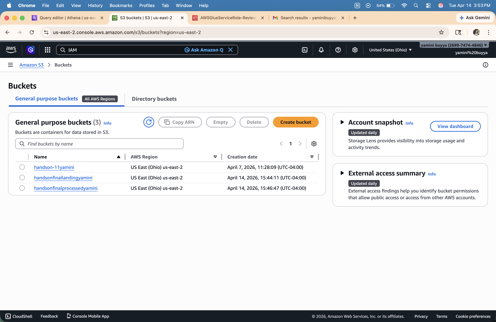

### 3. Create IAM Role for AWS Glue

Your Glue job needs permission to read from and write to S3.

1.  Go to the **IAM** service.
2.  Create a new **Role**.
3.  Select **AWS service** as the trusted entity and choose **Glue** as the use case.
4.  Attach the `AWSGlueServiceRole` managed policy.
5.  Attach the `AmazonS3FullAccess` policy (for this demo) or a more restrictive policy that only grants access to your two buckets.
6.  Name the role `AWSGlueServiceRole-Reviews` and create it.

### IAM Role Created

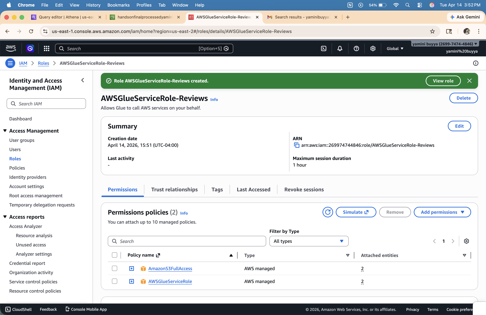

### 4. Create the AWS Glue ETL Job

1.  Go to the **AWS Glue** service.
2.  In the navigation pane, click on **ETL jobs**.
3.  Select the **Spark script editor** option to create a new job.
4.  Paste the contents of `src/glue_job_script.py` into the editor.
5.  Go to the **Job details** tab.
6.  Set the **Name** to `process_reviews_job`.
7.  Select the `AWSGlueServiceRole-Reviews` **IAM Role** you created in the previous step.
8.  Save the job.

### Glue Job Script

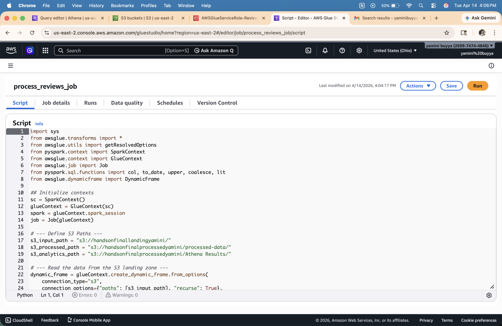

### Glue Job Details

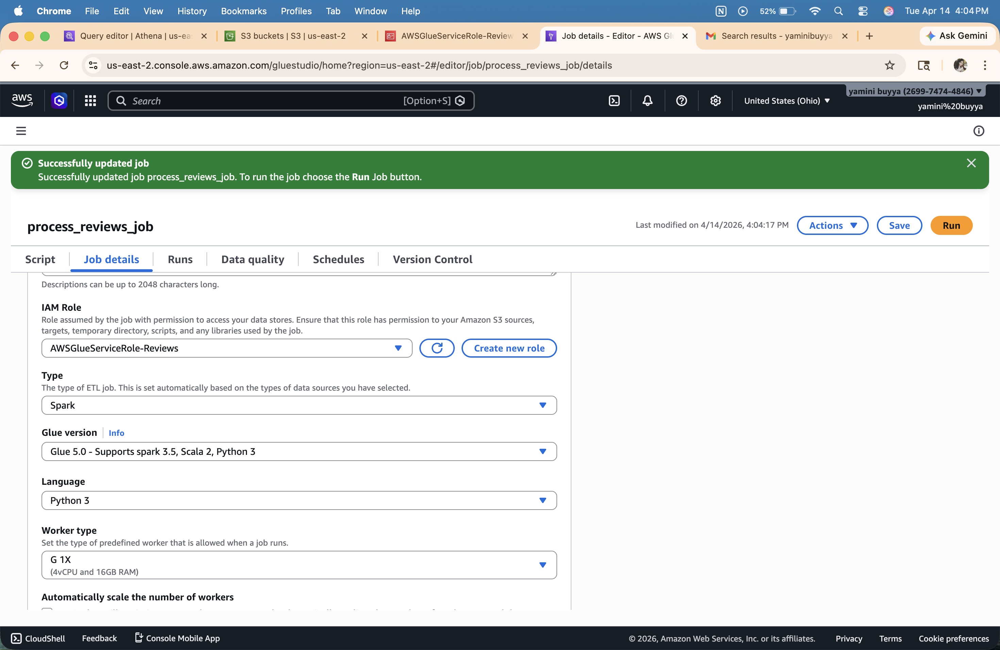

> **Note:** The script is already configured to use the `handsonfinallanding` and `handsonfinalprocessed` buckets.

### 5. Create the Lambda Trigger Function

This function will start the Glue job when a file is uploaded.

1.  Go to the **AWS Lambda** service and **Create function**.
2.  Select **Author from scratch**.
3.  Set the **Function name** to `start_glue_job_trigger`.
4.  Set the **Runtime** to **Python 3.10** (or any modern Python runtime).
5.  **Permissions:** Under "Change default execution role," select **Create a new role with basic Lambda permissions**. This role will be automatically named.
6.  Create the function.

### Lambda Function Created

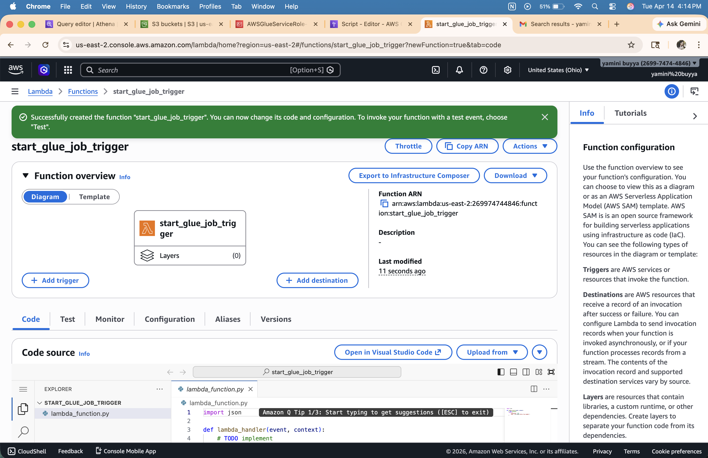

#### 5a. Add Lambda Code

Paste the contents of `src/lambda_function.py` into the code editor. Make sure the `GLUE_JOB_NAME` variable matches the name of your Glue job (`process_reviews_job`).

### Lambda Function Code Deployed

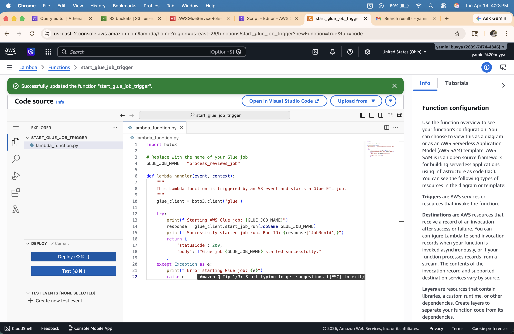

#### 5b. Add Lambda Permissions

The new Lambda role needs permission to start a Glue job.

1.  Go to the function's **Configuration** > **Permissions** tab and click the role name.
2.  In the IAM console, click **Add permissions** > **Create inline policy**.
3.  Use the JSON editor and paste the following policy:
    ```json
    {
      "Version": "2012-10-17",
      "Statement": [
        {
          "Effect": "Allow",
          "Action": "glue:StartJobRun",
          "Resource": "*"
        }
      ]
    }
    ```
4.  Name the policy `Allow-Glue-StartJobRun` and save it.

### Lambda Permissions Added

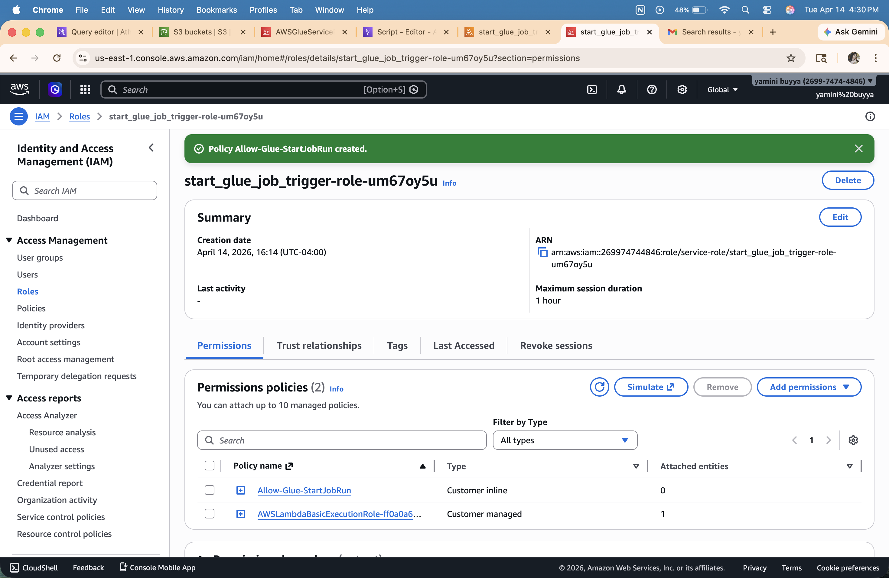

#### 5c. Add the S3 Trigger

1.  Go back to your Lambda function's main page.
2.  Click **Add trigger**.
3.  Select **S3** as the source.
4.  Select your `handsonfinallanding` bucket.
5.  Set the **Event type** to `s3:ObjectCreated:*` (or "All object create events").
6.  Acknowledge the recursive invocation warning and click **Add**.

### S3 Trigger Added

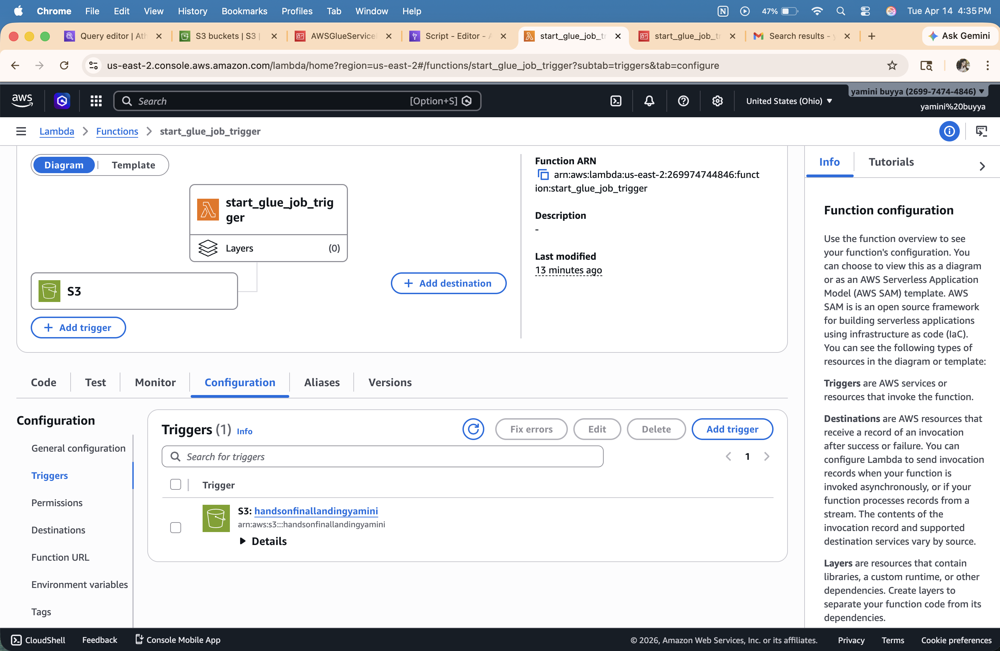

---

## 🚀 How to Run the Pipeline

Your pipeline is now fully deployed and automated!

1.  Take the sample `reviews.csv` file from the `data/` directory.
2.  Upload `reviews.csv` to the root of your `handsonfinallanding` S3 bucket.
3.  This will trigger the Lambda, which in turn starts the Glue job.
4.  You can monitor the job's progress in the **AWS Glue** console under the **Monitoring** tab.

### CSV File Uploaded to S3 (Triggers Lambda)

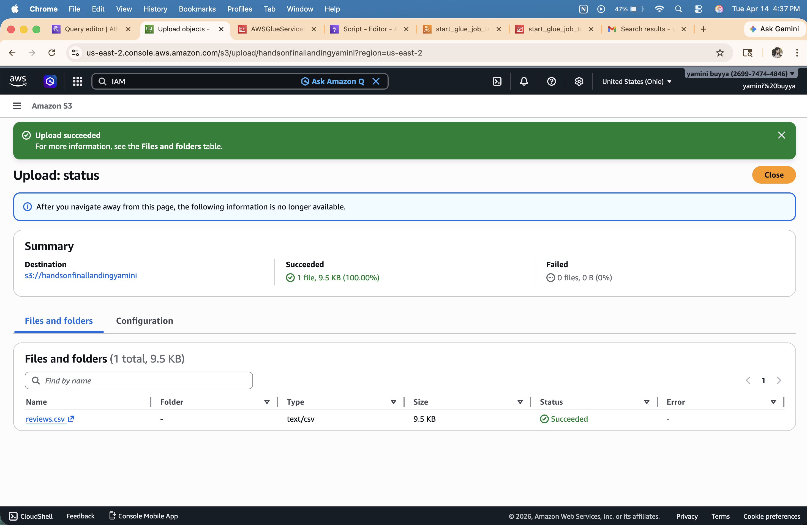

### Glue Job Succeeded

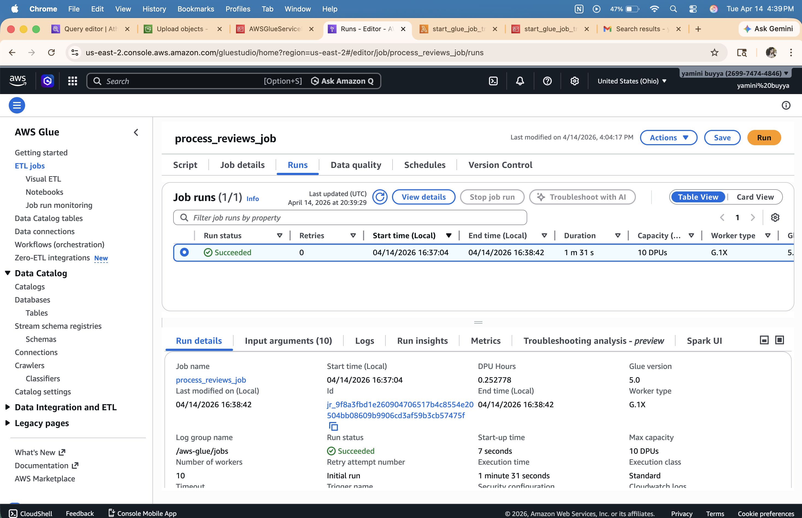

---

## 📈 Query Results

After the job (which may take 2-3 minutes to run), navigate to your `handsonfinalprocessed` bucket. You will find the results in the `Athena Results/` folder, organized into sub-folders for each query:

- `s3://handsonfinalprocessed/Athena Results/daily_review_counts/`
- `s3://handsonfinalprocessed/Athena Results/top_5_customers/`
- `s3://handsonfinalprocessed/Athena Results/rating_distribution/`

You will also find the complete, cleaned dataset in `s3://handsonfinalprocessed/processed-data/`.

### S3 Output Folders

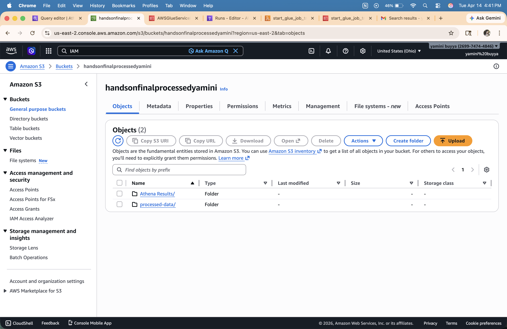

### S3 Output Folders Detail

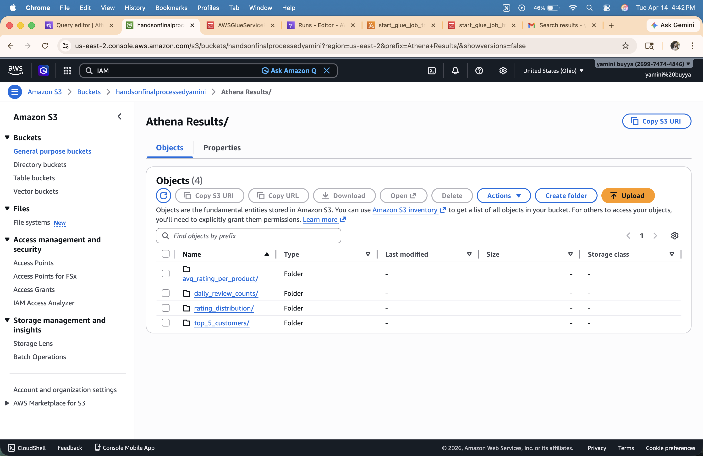

---

## 🧹 Cleanup

To avoid any future charges (especially if you're on the Free Tier), be sure to delete the resources you created:

1.  Empty and delete the `handsonfinallanding` and `handsonfinalprocessed` S3 buckets.
2.  Delete the `start_glue_job_trigger` Lambda function.
3.  Delete the `process_reviews_job` Glue job.
4.  Delete the `AWSGlueServiceRole-Reviews` IAM role.
